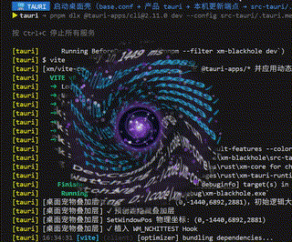
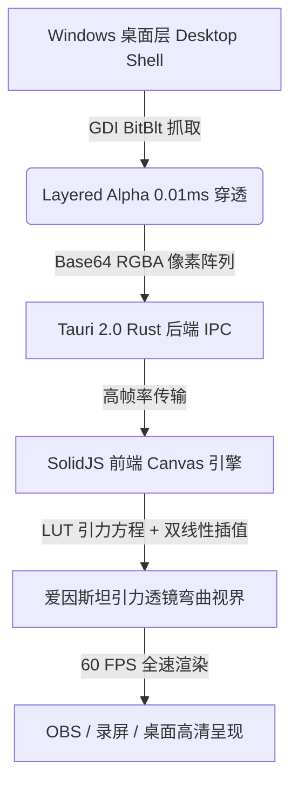

<div align="center">

# 🌌 暗核工坊 (XM Blackhole Engine)

**极具视觉冲击力与物理引力透镜弯曲的桌面暗黑黑洞引擎**

[](LICENSE)
[](https://tauri.app)
[](https://solidjs.com)
[](https://microsoft.com)
[](#-性能与架构)

*实时穿透底层桌面 · 爱因斯坦引力透镜光折射 · 拖拽 60 FPS 零卡顿 · OBS/录屏 100% 稳定兼容*

<br />



</div>

---

## 🌟 亮点特色

- 🌀 **爱因斯坦引力透镜 (Einstein Gravitational Lensing)**：基于 WebGL/Canvas 高清双线性插值 (Bilinear Sampling) 与 LUT 映射表算法，实时高精弯曲扭曲黑洞正下方的桌面壁纸与全量图标。
- ⚡ **微秒级 Layered Alpha 穿透采样**：独创 Windows GDI 高速采样引擎，采样过程耗时 **< 0.01 毫秒**，拖拽移动保持 100% 60 FPS 极致丝滑。
- 🎥 **OBS / 录屏软件 100% 稳定兼容**：完全无需 `WDA_EXCLUDEFROMCAPTURE` 频繁切换，彻底消灭正方形透明画框与闪屏现象，在 OBS、Bandicam、微信截图等工具中完美呈现。
- 🎯 **直觉拖拽吞噬与交互轮盘**：支持拖入桌面文件或文本片段，快速触发 **移入回收站**、**物理彻底粉碎**、**Bot4 私域引流** 以及 **AI 知识卡片提取**。
- ✨ **浩瀚深空星云与星系**：内置双螺旋星系与 68 颗无限深空闪烁繁星粒子，搭配多种能量色彩主题（暗紫 / 炽金 / 荧青）。

---

## 🚀 星码生态矩阵 & 旗舰产品推荐

> 💡 **暗核工坊 (XM Blackhole)** 是 **[星码行空 (XM Ecosystem)](https://github.com/aideluo/xm-core)** 旗下的开源视觉奇迹项目。探索星码生态，获取更多爆款 AI 效率神器与私域获客自动化工具：

<div align="center">

| 旗舰产品 | 核心优势与特色 | 体验 & 了解 |
| :--- | :--- | :---: |
| 🤖 **Bot4 自动加粉/私域引流机器人** | 智能客情维护、自动化多渠道加粉引流、私域客源裂变与自动化吸金引擎 | [👉 点击了解 Bot4 私域神器](https://github.com/aideluo/wx-bot4) |
| 🏪 **星码应用商店 (XM App Store)** | 汇聚 20+ 酷炫极客桌面工具、AI 图像处理、极速桌面搜索与自动化插件库 | [👉 访问星码应用商店](https://xmcore.top/xm-store/) |
| 🎵 **XM Music 音乐墙** | 极具未来感的沉浸式 3D 桌面音乐可视化大屏 | [👉 体验 XM Music](https://xmcore.top/xm-music/) |

</div>

---

## 🛠️ 快速开始

### 环境准备
- [Node.js](https://nodejs.org/) (>= 18.0)
- [pnpm](https://pnpm.io/) (>= 8.0)
- [Rust](https://www.rust-lang.org/) (>= 1.75) 与 [Tauri 2.0 CLI](https://tauri.app)
- OS: Windows 10 / Windows 11

### 本地构建与运行

```bash
# 1. 克隆代码库
git clone https://github.com/aideluo/xm-blackhole.git
cd xm-blackhole

# 2. 安装项目依赖
pnpm install

# 3. 启动开发模式
pnpm tauri dev

# 4. 打包 Windows 生产安装包
pnpm tauri build
```

---

## 🧠 物理采样架构设计



---

## 📄 License & Attribution Notice

This project is licensed under the **[GNU AGPL-3.0 with Mandatory Attribution Addendum](LICENSE)**.

### Key Terms:
1. **Reciprocal Open Source**: Any derivative works, forks, or projects building upon this codebase (including cloud/network services) **MUST remain 100% open source** under GNU AGPL-3.0. Commercial proprietary closure is prohibited.
2. **Mandatory Attribution**: All derivative projects **MUST prominently cite and link** to the original repository in the top third of their `README.md`:
   > `Based on [XM Blackhole Engine](https://github.com/aideluo/xm-blackhole) by aideluo.`
3. **Legal Remedies**: Failure to comply immediately terminates all license rights. The copyright holder (`aideluo` / XM Ecosystem) reserves full rights to demand mandatory takedowns and monetary damages for willful copyright infringement. See [LICENSE](LICENSE) for full details.
